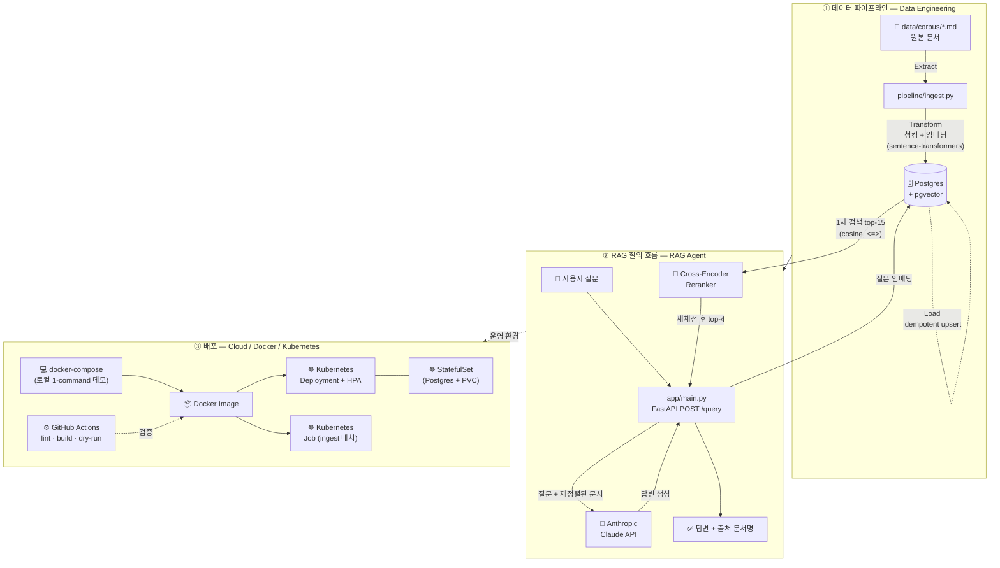

# RAG Agent

마크다운 문서를 검색·답변하는 RAG(Retrieval-Augmented Generation) 에이전트. 데이터 적재 파이프라인, 컨테이너화, Kubernetes 배포 매니페스트까지 한 레포에 담은 작은 포트폴리오 프로젝트입니다.

## 아키텍처

처음 보는 사람도 따라올 수 있도록 "데이터가 어떻게 들어가서(①) → 어떻게 검색·답변되고(②) → 어떻게 배포되는지(③)" 한 그림으로 정리했습니다.



- **① 데이터 엔지니어링**: `pipeline/ingest.py`가 Extract(파일 읽기) → Transform(청킹 + `sentence-transformers` 임베딩) → Load(Postgres/pgvector upsert) 3단계 배치 ETL을 idempotent하게 수행합니다(`ON CONFLICT (source, chunk_index) DO UPDATE`).
- **② RAG 에이전트**: FastAPI 서버가 질문을 임베딩 → pgvector에서 1차로 후보 15개를 검색 → cross-encoder(`mmarco-mMiniLMv2-L12-H384-v1`)가 질문-문서 쌍을 직접 재채점해 최종 top-4로 재정렬(rerank) → Anthropic Claude API로 컨텍스트 기반 답변 생성, 출처 파일명까지 함께 반환합니다. 임베딩 기반 1차 검색은 빠르지만 거리 계산이라 정밀도가 떨어지고, cross-encoder는 느리지만 질문과 문서를 함께 읽어 정밀하게 채점합니다 — 그래서 "1차로 넓게, 2차로 정밀하게" 두 단계로 구성했습니다.
- **③ 클라우드/컨테이너**: `Dockerfile` + `docker-compose.yml`로 로컬 1-command 데모, `k8s/`에 Deployment/StatefulSet/Job/HPA/ConfigMap/Secret 매니페스트를 갖춰 실제 운영 배포 형태를 보여줍니다. `.github/workflows/ci.yml`은 lint, Docker 빌드, k8s 매니페스트 dry-run 검증을 수행합니다.

> GitHub에서 이 README를 보면 위 다이어그램이 자동으로 도식(그래프 이미지)으로 렌더링됩니다(Mermaid 문법).

## 로컬 실행 (Docker Compose)

```bash
cp .env.example .env   # ANTHROPIC_API_KEY 채워넣기
export $(cat .env | xargs)

docker compose up -d postgres
docker compose --profile ingest run --rm ingest   # 샘플 문서 적재
docker compose up -d app

curl -X POST localhost:8000/query \
  -H "Content-Type: application/json" \
  -d '{"question": "회로 차단기(circuit breaker) 패턴이란 무엇인가요?"}'

curl localhost:8000/healthz
```

## Kubernetes 배포

실제 클러스터(minikube/kind 등)가 있다면:

```bash
docker build -t rag-agent:latest .
kubectl apply -f k8s/namespace.yaml
kubectl apply -f k8s/secret.example.yaml   # 실값으로 수정 후 적용 (secret.yaml로 복사해 사용 권장)
kubectl apply -f k8s/configmap.yaml -f k8s/postgres-init-configmap.yaml
kubectl apply -f k8s/postgres-statefulset.yaml -f k8s/postgres-service.yaml
kubectl apply -f k8s/ingest-job.yaml
kubectl apply -f k8s/app-deployment.yaml -f k8s/app-service.yaml -f k8s/hpa.yaml
```

클러스터 없이 매니페스트 문법만 검증하려면:

```bash
kubectl apply --dry-run=client -f k8s/
```

## 디렉터리 구조

```
app/         FastAPI 서비스 (db, embeddings, reranker, rag, main)
pipeline/    ETL 배치 적재 스크립트 (ingest.py)
data/corpus/ 샘플 지식베이스 (회복성 패턴 문서)
sql/         pgvector 스키마
k8s/         Kubernetes 매니페스트
.github/     CI 워크플로
```

## 기술 스택

FastAPI · Postgres + pgvector · sentence-transformers (embedding: `paraphrase-multilingual-MiniLM-L12-v2`, reranking: `mmarco-mMiniLMv2-L12-H384-v1` cross-encoder) · Anthropic Claude API · Docker / Docker Compose · Kubernetes · GitHub Actions
